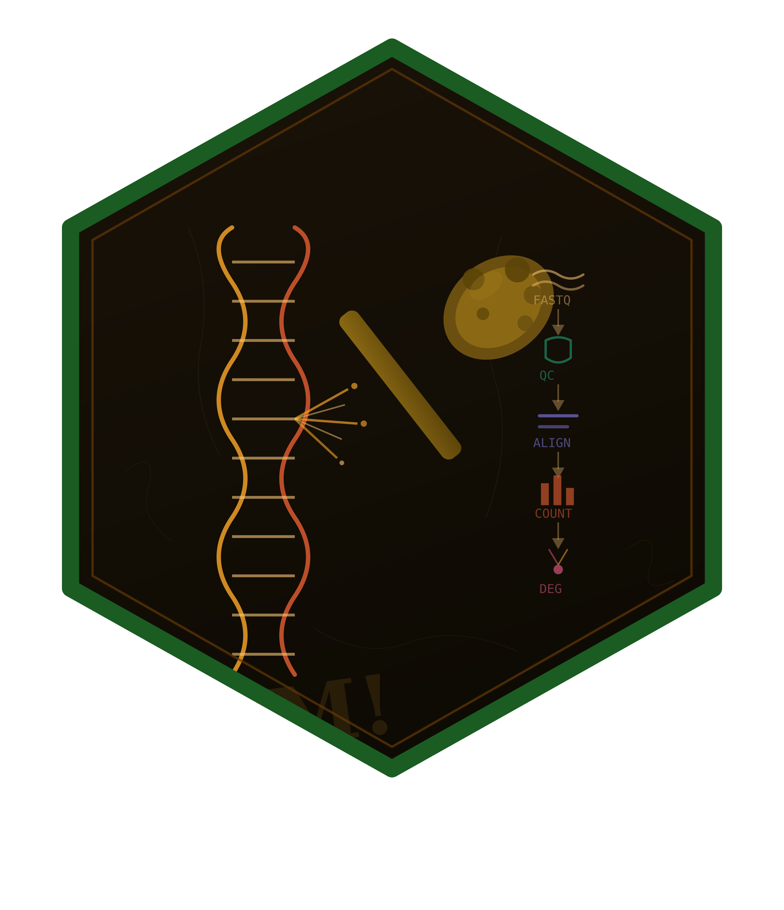

# bambamR: End-to-End RNA-Seq Processing from FASTQ to Publication-Ready Plots

[](https://github.com/CTTIR/bambamR/actions/workflows/R-CMD-check.yaml)
[](https://cttir.github.io/bambamR/)
[](https://CRAN.R-project.org/package=bambamR)
[](https://app.codecov.io/gh/CTTIR/bambamR?branch=main)
[](https://cran.r-project.org/package=bambamR)
[](https://cran.r-project.org/package=bambamR)
[](https://opensource.org/licenses/MIT)
[](https://lifecycle.r-lib.org/articles/stages.html#experimental)



## Introduction

**bambamR** is an R package for end-to-end RNA-seq analysis. It covers
the full pipeline from raw FASTQ/BAM files through quality control,
alignment, read counting, normalization, differential expression
analysis, and publication-ready visualizations including onco plots,
volcano plots, heatmaps, PCA, and MA plots.

### Key Design Principles

- **Graceful degradation**: All Bioconductor dependencies are optional.
  The package operates in *minimal mode* (CRAN-only) or *full mode*
  (with Bioconductor). It never breaks if Bioconductor is missing.
- **Consistent interface**: All exported functions use the `bb_` prefix.
  All plot functions return `ggplot2` objects for easy customization.
- **Bundled example data**: Every feature can be explored without
  downloading external files or installing Bioconductor.

### Minimal vs. Full Mode

| Feature                   |  Minimal (CRAN)   | Full (+ Bioconductor) |
|---------------------------|:-----------------:|:---------------------:|
| CPM / TPM normalization   |        Yes        |          Yes          |
| TMM / RLE normalization   |         –         |          Yes          |
| DESeq2 / edgeR / limma    |         –         |          Yes          |
| PCA, volcano, heatmap, MA |        Yes        |          Yes          |
| Onco plots                |        Yes        |          Yes          |
| FASTQ / BAM import        |      Base-R       | ShortRead / Rsamtools |
| Alignment wrappers        |        Yes        |          Yes          |
| Read counting             | featureCounts CLI |   GenomicAlignments   |
| Shiny interactive app     |        Yes        |          Yes          |

## Installation

Install from CRAN (when available):

``` r

install.packages("bambamR")
```

Install the development version from GitHub:

``` r

pak::pak("cttir/bambamR")
```

Optionally install Bioconductor packages for full-mode features:

``` r

BiocManager::install(c(
  "DESeq2", "edgeR", "limma",
  "ShortRead", "Rsamtools",
  "GenomicAlignments", "GenomicRanges"
))
```

``` r

library(bambamR)
```

------------------------------------------------------------------------

## Bundled Example Data

bambamR ships with ready-to-use datasets accessible via convenience
functions:

| Function | Contents |
|----|----|
| [`bb_example_counts()`](https://cttir.github.io/bambamR/reference/bb_example_counts.md) | 200 genes x 10 samples + metadata |
| [`bb_example_mutations()`](https://cttir.github.io/bambamR/reference/bb_example_mutations.md) | 300 mutations, 50 samples, 20 genes + clinical data |
| [`bb_example_de()`](https://cttir.github.io/bambamR/reference/bb_example_de.md) | 500-gene pre-computed DE results |

``` r

# RNA-seq count matrix (200 genes x 10 samples)
ex <- bb_example_counts()
counts   <- ex$counts
metadata <- ex$metadata
```

``` r

dim(counts)
#> [1] 200  10
counts[1:5, 1:5]
#>        Sample_01 Sample_02 Sample_03 Sample_04 Sample_05
#> TP53         525       533       485       515       519
#> KRAS         502       471       498       510       475
#> EGFR         479       504       488       514       473
#> BRAF         454       456       481       453       497
#> PIK3CA       470       469       506       483       532
```

``` r

metadata
#>           condition batch sex age
#> Sample_01   control     A   M  45
#> Sample_02   control     B   F  52
#> Sample_03   control     A   M  38
#> Sample_04   control     B   F  61
#> Sample_05   control     A   M  55
#> Sample_06 treatment     B   F  47
#> Sample_07 treatment     A   M  59
#> Sample_08 treatment     B   F  42
#> Sample_09 treatment     A   M  50
#> Sample_10 treatment     B   F  44
```

------------------------------------------------------------------------

## Normalization

### CPM (Counts Per Million)

CPM normalization works without any optional dependencies:

``` r

cpm <- bb_normalize(counts, method = "cpm")
```

### TPM (Transcripts Per Million)

TPM requires gene lengths:

``` r

gene_lengths <- readRDS(
  system.file("extdata", "example_gene_lengths.rds", package = "bambamR")
)
tpm <- bb_normalize(counts, method = "tpm",
                    gene_lengths = gene_lengths$length)
```

### TMM and RLE (Bioconductor)

With Bioconductor installed:

``` r

tmm <- bb_normalize(counts, method = "tmm")  # requires edgeR
rle <- bb_normalize(counts, method = "rle")  # requires DESeq2
```

------------------------------------------------------------------------

## Visualization

All plot functions return `ggplot2` objects that can be further
customized with `+ theme()`, `+ labs()`, etc.

### PCA Plot

``` r

bb_pca(cpm, metadata, color_by = "condition")
```


PCA plot colored by experimental condition.

``` r

bb_pca(cpm, metadata, color_by = "condition",
       shape_by = "batch", label = TRUE, point_size = 4)
```


PCA plot with shape mapping for batch effect.

------------------------------------------------------------------------

### Heatmap

``` r

bb_heatmap(cpm, n_genes = 30)
```


Heatmap of the 30 most variable genes.

------------------------------------------------------------------------

### Volcano Plot

Using the pre-computed DE results (no Bioconductor required):

``` r

de_results <- bb_example_de()
sig <- sum(de_results$padj < 0.05, na.rm = TRUE)
cat("Significant genes (FDR < 0.05):", sig, "\n")
#> Significant genes (FDR < 0.05): 20
```

``` r

bb_volcano(de_results, fc_cutoff = 1, p_cutoff = 0.05, n_label = 8)
```


Volcano plot highlighting differentially expressed genes.

------------------------------------------------------------------------

``` r

bb_volcano(de_results,
           fc_cutoff = 0.5,
           p_cutoff = 0.01,
           label_genes = c("TP53", "KRAS", "EGFR", "PTEN"),
           colors = c(up = "#E41A1C", down = "#377EB8", ns = "grey80"))
```


Volcano plot with custom gene labels and colors.

### MA Plot

``` r

bb_ma_plot(de_results, p_cutoff = 0.05)
```


MA plot showing fold-change vs.~mean expression.

------------------------------------------------------------------------

### Heatmap of Top DE Genes

``` r

bb_heatmap(cpm, de_result = de_results, n_genes = 25)
```


Heatmap of the top 25 differentially expressed genes.

------------------------------------------------------------------------

## Oncoplot

The
[`bb_oncoplot()`](https://cttir.github.io/bambamR/reference/bb_oncoplot.md)
function creates publication-ready waterfall-style mutation landscape
plots.

### Data Format

bambamR accepts a `data.frame` with columns `sample`, `gene`, and
`mutation_type`, or MAF-format data with `Hugo_Symbol`,
`Tumor_Sample_Barcode`, and `Variant_Classification`.

``` r

mut <- bb_example_mutations()
head(mut$mutations)
#>     sample   gene     mutation_type
#> 1 TCGA-021   NRAS      In_Frame_Ins
#> 2 TCGA-037 PIK3CA Missense_Mutation
#> 3 TCGA-037   BRAF       Splice_Site
#> 4 TCGA-031 PIK3CA   Frame_Shift_Ins
#> 5 TCGA-042    RB1 Missense_Mutation
#> 6 TCGA-008   NRAS Missense_Mutation
```

### Basic Oncoplot

``` r

bb_oncoplot(mut$mutations, n_genes = 10, show_barplot = FALSE)
```


Oncoplot showing the top 10 mutated genes.

------------------------------------------------------------------------

### Oncoplot with Clinical Annotations

``` r

bb_oncoplot(mut$mutations, n_genes = 8,
            annotation_df = mut$clinical, show_barplot = FALSE)
```


Oncoplot with clinical annotation tracks (Stage, Gender, Smoking).

### Selecting Specific Genes

``` r

bb_oncoplot(mut$mutations, show_barplot = FALSE,
            genes = c("TP53", "KRAS", "PIK3CA", "BRAF", "EGFR"))
```


Oncoplot showing five selected genes.

### Custom Colors

``` r

my_colors <- c(
  "Missense_Mutation" = "#3182BD",
  "Nonsense_Mutation" = "#E6550D",
  "Frame_Shift_Del"   = "#31A354",
  "Frame_Shift_Ins"   = "#756BB1",
  "Splice_Site"       = "#DE2D26",
  "In_Frame_Del"      = "#636363",
  "In_Frame_Ins"      = "#FDAE6B",
  "Translation_Start_Site" = "#BCBDDC",
  "Multi_Hit"         = "#FDD0A2",
  "Other"             = "#BDBDBD"
)
bb_oncoplot(mut$mutations, n_genes = 8,
            mutation_colors = my_colors, show_barplot = FALSE)
```


Oncoplot with a custom color palette.

------------------------------------------------------------------------

## FASTQ Import

bambamR includes a small example FASTQ file (100 reads, 75 bp):

``` r

fq_path <- system.file("extdata", "example_reads.fastq",
                        package = "bambamR")
reads <- bb_read_fastq(fq_path, n = 5)
reads
#>                    id
#> 1 read_0001 length=75
#> 2 read_0002 length=75
#> 3 read_0003 length=75
#> 4 read_0004 length=75
#> 5 read_0005 length=75
#>                                                                      sequence
#> 1 CCCTAGATGAGTGGATTCACCTATCGGCGGTATATGTTTCGAAATCTGAGACGCAAAGACCTGTATAAAATTCCC
#> 2 GCGAAGGGATAATAGTCCCTACGAATCTGAAAATGACTAACATGCGTTAGCAACGGTACTGATGGGTATAGGTCA
#> 3 AGGAGTGTTTAACCGGTGACAGCGCCTAATTCTGGAGGGTGGTACCACACACCAACATTACAGATCCGACGACAT
#> 4 ACTAGTCAGGAATCATGTGTGTGATTCCATAGACACATGGCGCGGAAGCCGGCCATATCCCCGTAACGAGCCGCC
#> 5 CGTTCGGCAGATCTACCGGTGTGACTTGACCGGCATTGCTCACCAGAAAGAGTGTAGTTGCCTGAGCCTGTAATG
#>                                                                       quality
#> 1 >FEGGCIHGFDIEEIHGIIGEFFDCEFGCBEAIIIEGF=IDEEHEFBGAGCIBICIBHCDIHHEGHGA?GEGCCG
#> 2 HGIBCGDHGAIEGADGHFFAIIEFIIHFBIGHBIFFBDGFDFEIHIAFD=HHC=HHIGGFICH=HDIHHHCEIIB
#> 3 GHEEHHBABGDHDIFGFFEEGGHIGFEDHEIEDFFIHDGHE>AICHHE>GBHECFCH?EHEIGDEEICCEGIIHH
#> 4 EE?IGFFIEGFIEIGIHEIIHDHGHEEHFGIHHGFGFCFIHHAIEFHFBHHHAHGHI>EIBFHDIHFFIHHBHFE
#> 5 EIGCIIEGHGIDHEICGEDHCGEGHEEHIHDHGIHAEEFGIEIB=IFDBIBEGFIGIIIHAEG?DIGIBIFHFHG
```

When `ShortRead` is available,
[`bb_read_fastq()`](https://cttir.github.io/bambamR/reference/bb_read_fastq.md)
uses it automatically. Otherwise, a base-R parser handles plain and
gzipped FASTQ files.

## Quality Control

``` r

qc <- bb_qc(fastq_path = fq_path)
qc
#> bambamR QC Summary
#> ==================
#> Files analyzed: 1 
#>   example_reads.fastq: 100 reads
```

``` r

bb_qc_summary(qc)
#>                  file total_reads median_gc mapping_rate
#> 1 example_reads.fastq         100 0.4933333           NA
```

``` r

bb_plot_qc(qc)
```


QC visualization panel: per-position quality, GC content, and read
length distribution.

------------------------------------------------------------------------

## Differential Expression

Three DE methods are supported, each requiring an optional Bioconductor
package. All three return a standardized `data.frame` with columns
`gene`, `log2fc`, `pvalue`, `padj`, and optionally `basemean`.

``` r

# DESeq2 (requires DESeq2)
de <- bb_deseq2(counts, metadata)

# edgeR (requires edgeR)
de <- bb_edger(counts, group = metadata$condition)

# limma-voom (requires limma + edgeR)
design <- model.matrix(~ condition, data = metadata)
de <- bb_limma_voom(counts, design)
```

The standardized output ensures that
[`bb_volcano()`](https://cttir.github.io/bambamR/reference/bb_volcano.md),
[`bb_ma_plot()`](https://cttir.github.io/bambamR/reference/bb_ma_plot.md),
[`bb_heatmap()`](https://cttir.github.io/bambamR/reference/bb_heatmap.md),
and
[`bb_export_csv()`](https://cttir.github.io/bambamR/reference/bb_export_csv.md)
work identically regardless of the DE method used.

## Export

``` r

bb_export_csv(de_results, "de_results.csv")
bb_export_tsv(de_results, "de_results.tsv")
bb_export_rds(de_results, "de_results.rds")
```

------------------------------------------------------------------------

## Full Pipeline

The
[`bb_pipeline()`](https://cttir.github.io/bambamR/reference/bb_pipeline.md)
function runs the entire analysis end-to-end. It accepts entry at three
stages:

``` r

# From FASTQ files
result <- bb_pipeline(
  fastq_dir    = "raw_reads/",
  genome_index = "STAR_index/",
  annotation   = "genes.gtf",
  sample_info  = metadata,
  aligner      = "STAR",
  de_method    = "DESeq2",
  threads      = 8
)

# From BAM files (skip alignment)
result <- bb_pipeline(
  bam_dir     = "aligned/",
  annotation  = "genes.gtf",
  sample_info = metadata
)

# From a count matrix (skip alignment + counting)
result <- bb_pipeline(
  count_matrix = my_counts,
  sample_info  = metadata,
  de_method    = "edgeR"
)
```

The returned `bb_result` object bundles counts, metadata, DE results,
and all generated plots:

``` r

result$counts          # count matrix
result$de_results      # standardized DE data.frame
result$plots$pca       # ggplot object
result$plots$volcano   # ggplot object
result$plots$heatmap   # ggplot object
```

## Interactive Shiny App

Launch a browser-based dashboard for interactive analysis:

``` r

bb_run_app()
```

The app provides:

- Data upload (CSV, TSV, RDS) with live preview
- Configurable normalization and DE parameters
- Interactive plots (volcano, PCA, heatmap, MA, oncoplot)
- One-click export (CSV, RDS, PDF)

------------------------------------------------------------------------

## Function Reference

#### Import

| Function | Description |
|----|----|
| [`bb_read_fastq()`](https://cttir.github.io/bambamR/reference/bb_read_fastq.md) | Read FASTQ files |
| [`bb_read_bam()`](https://cttir.github.io/bambamR/reference/bb_read_bam.md) | Read BAM files |
| [`bb_count_bam()`](https://cttir.github.io/bambamR/reference/bb_count_bam.md) | Count reads in BAM |

#### Quality Control

| Function | Description |
|----|----|
| [`bb_qc()`](https://cttir.github.io/bambamR/reference/bb_qc.md) | Compute QC metrics |
| [`bb_qc_summary()`](https://cttir.github.io/bambamR/reference/bb_qc_summary.md) | Tabular QC summary |
| [`bb_plot_qc()`](https://cttir.github.io/bambamR/reference/bb_plot_qc.md) | QC visualization panel |

#### Alignment & Counting

| Function | Description |
|----|----|
| [`bb_align()`](https://cttir.github.io/bambamR/reference/bb_align.md) | Align with STAR / HISAT2 / minimap2 |
| [`bb_count_reads()`](https://cttir.github.io/bambamR/reference/bb_count_reads.md) | Count reads per gene |

#### Normalization

| Function | Description |
|----|----|
| [`bb_normalize()`](https://cttir.github.io/bambamR/reference/bb_normalize.md) | CPM, TPM, TMM, or RLE |

#### Differential Expression

| Function | Description |
|----|----|
| [`bb_deseq2()`](https://cttir.github.io/bambamR/reference/bb_deseq2.md) | DESeq2 wrapper |
| [`bb_edger()`](https://cttir.github.io/bambamR/reference/bb_edger.md) | edgeR quasi-likelihood wrapper |
| [`bb_limma_voom()`](https://cttir.github.io/bambamR/reference/bb_limma_voom.md) | limma-voom wrapper |

#### Visualization

| Function | Description |
|----|----|
| [`bb_oncoplot()`](https://cttir.github.io/bambamR/reference/bb_oncoplot.md) | Waterfall mutation plot |
| [`bb_volcano()`](https://cttir.github.io/bambamR/reference/bb_volcano.md) | Volcano plot |
| [`bb_heatmap()`](https://cttir.github.io/bambamR/reference/bb_heatmap.md) | Clustered heatmap |
| [`bb_pca()`](https://cttir.github.io/bambamR/reference/bb_pca.md) | PCA plot |
| [`bb_ma_plot()`](https://cttir.github.io/bambamR/reference/bb_ma_plot.md) | MA plot |

#### Pipeline & Export

| Function | Description |
|----|----|
| [`bb_pipeline()`](https://cttir.github.io/bambamR/reference/bb_pipeline.md) | Full end-to-end pipeline |
| [`bb_export_csv()`](https://cttir.github.io/bambamR/reference/bb_export_csv.md) | Export as CSV |
| [`bb_export_tsv()`](https://cttir.github.io/bambamR/reference/bb_export_tsv.md) | Export as TSV |
| [`bb_export_rds()`](https://cttir.github.io/bambamR/reference/bb_export_rds.md) | Export as RDS |

#### Example Data & App

| Function | Description |
|----|----|
| [`bb_example_counts()`](https://cttir.github.io/bambamR/reference/bb_example_counts.md) | Example count matrix |
| [`bb_example_mutations()`](https://cttir.github.io/bambamR/reference/bb_example_mutations.md) | Example mutation data |
| [`bb_example_de()`](https://cttir.github.io/bambamR/reference/bb_example_de.md) | Example DE results |
| [`bb_run_app()`](https://cttir.github.io/bambamR/reference/bb_run_app.md) | Launch Shiny dashboard |

## Citation

If you use bambamR in your research, please cite:

> Heller R, Witte H, Steinestel K (2026). *bambamR: End-to-End RNA-Seq
> Processing from FASTQ to Publication-Ready Plots.* R package version
> 0.1.0. <https://github.com/cttir/bambamR>

## Use of LLM tools

Portions of this package were prepared with assistance from large
language model tooling for narrowly defined, non-authorial tasks:
copyediting, prose smoothing, Markdown/LaTeX formatting, scaffolding of
boilerplate files (CI configs, build scripts), code refactoring. The
tools used were [Chat
AI](https://kisski.gwdg.de/leistungen/2-02-llm-service/), the LLM
service of KISSKI (GWDG), and a self-hosted **Mistral Small (24B,
Apache-2.0)** run locally via [Ollama](https://ollama.com/) and the
`ollamar` R package — local inference only, with no data sent to third
parties for the self-hosted model.

All scientific claims, methodological choices, analyses,
interpretations, and conclusions are the author’s own. No LLM-generated
text was incorporated without review and revision, and every reference
was verified against its DOI, arXiv ID, or ISBN.

## Session Info

``` r

sessionInfo()
#> R version 4.6.0 (2026-04-24)
#> Platform: x86_64-pc-linux-gnu
#> Running under: Ubuntu 24.04.4 LTS
#> 
#> Matrix products: default
#> BLAS:   /usr/lib/x86_64-linux-gnu/openblas-pthread/libblas.so.3 
#> LAPACK: /usr/lib/x86_64-linux-gnu/openblas-pthread/libopenblasp-r0.3.26.so;  LAPACK version 3.12.0
#> 
#> locale:
#>  [1] LC_CTYPE=C.UTF-8       LC_NUMERIC=C           LC_TIME=C.UTF-8       
#>  [4] LC_COLLATE=C.UTF-8     LC_MONETARY=C.UTF-8    LC_MESSAGES=C.UTF-8   
#>  [7] LC_PAPER=C.UTF-8       LC_NAME=C              LC_ADDRESS=C          
#> [10] LC_TELEPHONE=C         LC_MEASUREMENT=C.UTF-8 LC_IDENTIFICATION=C   
#> 
#> time zone: UTC
#> tzcode source: system (glibc)
#> 
#> attached base packages:
#> [1] stats     graphics  grDevices utils     datasets  methods   base     
#> 
#> other attached packages:
#> [1] bambamR_0.1.0
#> 
#> loaded via a namespace (and not attached):
#>  [1] farver_2.1.2                Biostrings_2.80.1          
#>  [3] S7_0.2.2                    bitops_1.0-9               
#>  [5] fastmap_1.2.0               GenomicAlignments_1.48.0   
#>  [7] digest_0.6.39               lifecycle_1.0.5            
#>  [9] pwalign_1.8.0               cluster_2.1.8.2            
#> [11] statmod_1.5.2               compiler_4.6.0             
#> [13] rlang_1.2.0                 sass_0.4.10                
#> [15] tools_4.6.0                 yaml_2.3.12                
#> [17] knitr_1.51                  S4Arrays_1.12.0            
#> [19] labeling_0.4.3              htmlwidgets_1.6.4          
#> [21] interp_1.1-6                DelayedArray_0.38.2        
#> [23] RColorBrewer_1.1-3          ShortRead_1.70.0           
#> [25] abind_1.4-8                 BiocParallel_1.46.0        
#> [27] withr_3.0.3                 hwriter_1.3.2.1            
#> [29] BiocGenerics_0.58.1         desc_1.4.3                 
#> [31] grid_4.6.0                  stats4_4.6.0               
#> [33] latticeExtra_0.6-31         colorspace_2.1-2           
#> [35] edgeR_4.10.1                ggplot2_4.0.3              
#> [37] scales_1.4.0                iterators_1.0.14           
#> [39] SummarizedExperiment_1.42.0 cli_3.6.6                  
#> [41] rmarkdown_2.31              crayon_1.5.3               
#> [43] ragg_1.5.2                  generics_0.1.4             
#> [45] otel_0.2.0                  rjson_0.2.23               
#> [47] cachem_1.1.0                parallel_4.6.0             
#> [49] XVector_0.52.0              matrixStats_1.5.0          
#> [51] vctrs_0.7.3                 Matrix_1.7-5               
#> [53] jsonlite_2.0.0              IRanges_2.46.0             
#> [55] GetoptLong_1.1.1            patchwork_1.3.2            
#> [57] S4Vectors_0.50.1            ggrepel_0.9.8              
#> [59] clue_0.3-68                 systemfonts_1.3.2          
#> [61] jpeg_0.1-11                 locfit_1.5-9.12            
#> [63] foreach_1.5.2               limma_3.68.4               
#> [65] jquerylib_0.1.4             glue_1.8.1                 
#> [67] pkgdown_2.2.0               codetools_0.2-20           
#> [69] gtable_0.3.6                shape_1.4.6.1              
#> [71] deldir_2.0-4                GenomicRanges_1.64.0       
#> [73] ComplexHeatmap_2.28.0       htmltools_0.5.9            
#> [75] Seqinfo_1.2.0               circlize_0.4.18            
#> [77] R6_2.6.1                    textshaping_1.0.5          
#> [79] doParallel_1.0.17           evaluate_1.0.5             
#> [81] lattice_0.22-9              Biobase_2.72.0             
#> [83] png_0.1-9                   Rsamtools_2.28.0           
#> [85] cigarillo_1.2.0             bslib_0.11.0               
#> [87] Rcpp_1.1.1-1.1              SparseArray_1.12.2         
#> [89] DESeq2_1.52.0               xfun_0.59                  
#> [91] fs_2.1.0                    MatrixGenerics_1.24.0      
#> [93] GlobalOptions_0.1.4
```
